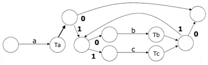
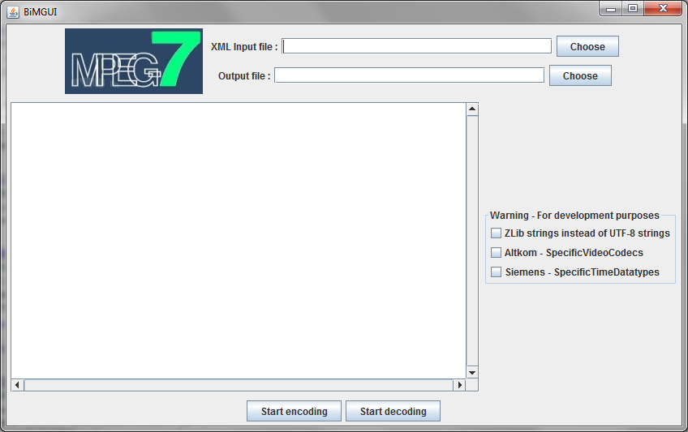

# Multimedia Content Storage and Description

Andrzej Matiolanski, Mikolaj Leszczuk

## Introduction

Metadata is additional information used to describe stored data, often defined as "data about data". Metadata speeds up and makes the processing of large-scale multimedia databases easier by keeping crucial information together with the multimedia content. It avoids additional processing and searching over the multimedia database.

The purpose of the exercise is to become familiar with metadata standards and their practical use based on the examples of Exchangeable Image File Format (Exif) and the Moving Picture Experts Group 7 (MPEG-7). Furthermore, students will investigate various multimedia data storage formats.

Please download laboratory materials and video sequences before starting the exercise.

## Exercise

Please boot the computer into Windows and log in.

## Exchangeable Image File Format (Exif)

Exif is a specification of metadata format for images and audio. It allows storing additional information about multimedia content. It supports formats such as JPEG, TIFF, RIFF and WAV (for audio).

### Tasks

1. Download a few random images from the Internet, or take a photo using a smartphone.
2. Use the free program Exif Reader (directory `EXIF` in the laboratory materials) or appropriate MATLAB command(s) and function(s) to inspect metadata in your images.
3. Look at metadata stored with each image. Do images have the same set of metadata?
4. Consider, optionally, the possibility of adding or removing information from a metadata set.

## Moving Picture Experts Group 7 (MPEG-7)

MPEG-7 is a standard for multimedia content description (ISO/IEC 15938). The MPEG-7 content description is associated with the content itself to allow fast and efficient searching for material that is of interest to the user. MPEG-7 is formally called the Multimedia Content Description Interface. Unlike MPEG-1, MPEG-2 and MPEG-4, it does not apply to the actual encoding of moving pictures and audio. It uses XML to store metadata.

MPEG-7 was designed to standardize:

- A set of Description Schemes (DS) and Descriptors (D)
- A language to specify these schemes, called the Description Definition Language (DDL)
- A scheme for coding the description (Binary-in-MPEG)

## Encoding Binary XML - Binary-in-MPEG

Binary-in-MPEG (BiM) is a standard binarization of XML files. Based on an XML document structure, a state graph is created, which is used to encode and decode the record.

Example:

```xml
<sequence>
  <element name="a" type="Ta"/>
  <choice minOccurs="0" maxOccurs="unbounded">
    <element name="b" type="Tb"/>
    <element name="c" type="Tc"/>
  </choice>
</sequence>
```



*Fig. Exemplary state graph.*

Encoding example: `abbcbbc -> 1010111010110`

## Description Definition Language (DDL)

Description Definition Language (DDL) is a standard that defines the syntax extension of MPEG-7 documents. An example of the definition of a new element is presented below:

```xml
<complexType name="MyVideoSegmentType">
  <complexContent>
    <extension base="mpeg7:VideoSegmentType">
      <sequence>
        <element name="Summary" type="string" minOccurs="0"/>
      </sequence>
    </extension>
  </complexContent>
</complexType>
```

One should place this definition in the file that defines the schema (`.xsd` file).

A complete example has been placed in the laboratory materials: `BiM_impl/examples/5`. Directory `5.1` contains an example without new DDL elements, while `5.2` includes a new DDL element.

### Tasks

1. Get familiar with the structure of the MPEG-7 documents.
2. Use a provided implementation of BiM to examine the sample XML documents.
3. Account for the possibility of compression by checking the size of metadata files before and after BiM encoding. What is the average compression ratio?
4. Compare the size of output files with popular compression methods (e.g. `gzip`, `zip`).
5. Create a graph that shows the difference.
6. Based on the example, extend the document with a new element that does not belong to MPEG-7, using DDL, and examine the compression ratio behavior.

Note: the implementation of BiM can be used as a validator.



*Fig. Implementation of BiM.*

## Multimedia Data Storage Formats

Media can be saved using different data formats. The same content can look the same, or very similar, but be written in a slightly different way. More information can be found in the lecture slides.

### Tasks

1. Download a few high-resolution images from the Internet, or use your own sample images.
2. Save or convert images to various formats: JPEG, TIFF, PNG, BMP, etc.
3. Check the difference between the same image saved in various formats. Compare the images pixel-by-pixel automatically, using appropriate command(s) and function(s) in MATLAB or another programming language.
4. Extract frames from the video sequences and check the difference between the structures derived from video sequences saved in different formats. Use appropriate command(s) and function(s) in MATLAB or another programming language. If there are no codecs on your computer to open a given video format, go to the next file.
5. Are images and video sequences different in various formats? What is the average difference ratio?

## Useful Commands and Functions

### MATLAB

- `imread` - Read image from graphics file - <https://www.mathworks.com/help/matlab/ref/imread.html>
- `imfinfo` - Information about graphics file - <https://www.mathworks.com/help/matlab/ref/imfinfo.html>
- `VideoReader` - Create an object to read video files - <https://www.mathworks.com/help/matlab/ref/videoreader.html>
- `immse` - Mean-squared error - <https://www.mathworks.com/help/images/ref/immse.html>
- `psnr` - Peak Signal-to-Noise Ratio (PSNR) - <https://www.mathworks.com/help/images/ref/psnr.html>
- `ssim` - Structural Similarity Index (SSIM) for measuring image quality - <https://www.mathworks.com/help/images/ref/ssim.html>

### OpenCV

- `imread` - Loads an image from a file - <https://docs.opencv.org/4.x/d4/da8/group__imgcodecs.html>
- `VideoCapture` - Class for video capturing from video files, image sequences or cameras - <https://docs.opencv.org/4.x/d8/dfe/classcv_1_1VideoCapture.html>

## References

1. 'Directory of Books, Journals & Conferences on Digital Watermarking and Digital Watermarking Assessment Tools', <http://knowledgebase.aegisdrm.com/knowledgebase_digital_watermarking_drm.htm>
2. Adjeroh D. A., Lee M. C.: "Scene-Adaptive Transform Domain Video Partitioning", IEEE Transactions on Multimedia, 2004, vol. 6, no. 1, pp. 58-69.
3. Aghabari Z., Kaneko K., Makinouchi A.: "Content-Trajectory Approach for Searching Video Databases", IEEE Transactions on Multimedia, 2003, vol. 5, no. 4, pp. 516-531.
4. Au O.: 'Visually Detectable Halftone Image Watermarking', <http://www.ee.ust.hk/~eeau/demo_halftoneWatermark_B.htm>
5. Austerberry D.: *The Technology of Video and Audio Streaming*. Focal Press, Oxford 2002.
6. Benini S., Xu L. Q., Leonardi R.: "Using Lateral Ranking for Motion-Based Video Shot Retrieval and Dynamic Content Characterization", Proc. Fourth International Workshop on Content-Based Multimedia Indexing CBMI'2005, Riga, Latvia, 2005.
7. Boavida F., Monteiro E., Orvalho J.: *Protocols and Systems for Interactive Distributed Multimedia*. Springer-Verlag, Berlin 2002.
8. Browne P., Smeaton A. F., Murphy N., O'Connor N., Marlow S., Berrut C.: "Evaluating and Combining Digital Video Shot Boundary Detection Algorithms", Proc. of the Fourth Irish Machine Vision and Information Processing Conference, Belfast, North Ireland, 2000.
9. Cole E.: *Hiding in Plain Sight: Steganography and the Art of Covert Communication*. Wiley Publishing, Inc., ISBN 0471444499, 2003.
10. DCMI: "Dublin Core Metadata Initiative", <http://dublincore.org/>, 2004.
11. Digimarc Corporation: 'Digimarc Corporation', <http://www.digimarc.com/>
12. Duplaga M., Juszkiewicz K., Leszczuk M., Marek M., Papir Z.: "Design of Medical Digital Video Library", Proc. Fourth International Workshop on Content-Based Multimedia Indexing CBMI'2005, Riga, Latvia, 2005.
13. Fan J., Elmagarmid A. K., Zhu X., Aref W. G., Wu L.: "ClassView: Hierarchical Video Shot Classification, Indexing, and Accessing", IEEE Transactions on Multimedia, 2004, vol. 6, no. 1, pp. 70-86.
14. Farag W. E., Abdel-Wahab H.: "A new paradigm for the analysis of MPEG compressed videos", Journal of Network and Computer Applications, 2002, vol. 5, no. 2, pp. 109-127.
15. Halsall F.: *Multimedia Communications Applications, Networks, Protocols and Standards*. Addison-Wesley, Essex 2001.
16. Hanjalic A.: *Content-based Analysis of Digital Video*. Kluwer Academic Publishers, Boston 2004.
17. Hori C., Furui S.: "A New Approach to Automatic Speech Summarisation", IEEE Transactions on Multimedia, 2003, vol. 5, no. 3, pp. 368-378.
18. ITU-R Recommendation BT.500: *Methodology for the Subjective Assessment of the Quality of Television Pictures*, 06/2002.
19. Kender J. R., Yeo B. L.: "Video Scene Segmentation Via Continuous Video Coherence", Proc. IEEE Computer Society Conference on Computer Vision and Pattern Recognition CVPR'1998, Santa Barbara, USA, 1998, pp. 367-377.
20. Krunz M., Tripathi S. K.: "Scene-Based Characterization of VBR MPEG-Compressed Video Traffic", Proc. ACM Sigmetrics'97, Seattle, USA, 1997.
21. Kunze J.: "Encoding Dublin Core in HTML", RFC 2731, 1999.
22. Lee H. Y., Lee, H. K., Ha Y. H.: "Spatial Colour Descriptor for Image Retrieval and Video Segmentation", IEEE Transactions on Multimedia, 2003, vol. 5, no. 3, pp. 358-367.
23. Leszczuk M.: "Usage of Bisection Method for Shot Detection in Video Content for Digital Video Library", Proc. 11th Open European Summer School: "Networked Applications" EUNICE'2005, Colmenarejo (Madryt), Hiszpania, 2005, pp. 218-221.
24. Lombardo A., Morabito G., Schembra G.: "Modelling Intra-media and Intermedia Relationships In Multimedia Network Analysis Through Multiple Timescale Statistics", IEEE Transactions on Multimedia, 2004, vol. 6, no. 1, pp. 142-157.
25. Manjunath B. S., Salembier P., Sikora T.: *Introduction to MPEG-7 Multimedia Content Description Interface*. John Wiley & Sons, Chichester, 2002.
26. Mashat A., Kara M.: "Performance evaluation of a scene-based model for VBR MPEG traffic", in: *System Performance Evaluation: Methodologies and Application*, CRC Press, 2000, pp. 123-142.
27. Mitchell J., Pennebaker W., Fogg C., LeGall D. J.: *MPEG video compression standard*. International Thomson Publishing, New York 1996, p. 58.
28. Naci U., Hanjalic A.: "A Unified Framework for Fast and Effective Shot Transition Detection Based on Analysis of Spatiotemporal Video Data Blocks", Proc. Fourth International Workshop on Content-Based Multimedia Indexing CBMI'2005, Riga, Latvia, 2005.
29. Po L. M., Wong K. M.: "A New Palette Histogram Similarity Measure for MPEG-7 Dominant Color Descriptor", Proc. IEEE International Conference on Image Processing 2004 ICIP'2004, Singapore, 2004, vol. 3, pp. 1533-1536.
30. Roberts J., Mocci U., Virtamo J.: *Broadband network tele-traffic*. Springer-Verlag, Berlin 1996, pp. 20-25.
31. Rose O.: "Simple and efficient models for variable bit rate MPEG video traffic", *Performance Evaluation*, 1997, vol. 30, pp. 69-85.
32. Sang-Jo Y., Seong-Dae K.: "Traffic modelling and QoS prediction for MPEG-coded video services over ATM networks using scene level statistical characteristics", *Journal of High-Speed Networks*, 1999, vol. 8, no. 3, pp. 211-224.
33. Skarbek W., Galinski G., Wnukowicz K.: "Tree Based Multimedia Indexing - a Survey", Proc. Krajowa Konferencja Radiokomunikacji, Radiofonii i Telewizji KKRRiT'2004, Warszawa 2004, pp. 77-85.
34. Skarbek W.: "MPEG-7", Proc. IX Konferencja PLOUG'2003, Koscielisko, 2003, pp. 102-119.
35. Smith J. R., Chang S. F.: "Searching for Images and Videos on the World-Wide Web", CU/CTR Technical Report 459-96-25, 1996.
36. Smith J. R., Chang S. F.: "VisualSEEk: a fully automated content-based image query system", Proc. ACM Intern. Conf. Multimedia (ACM MM), Boston, USA, 1996, pp. 87-98.
37. Smith J. R., Chang S.-F.: "An Image and Video Search Engine for the World-Wide Web", Proc. Symposium on Electronic Imaging: Science and Technology - Storage & Retrieval for Image and Video Databases V EI'1997, San Jose, USA, 1997, pp. 84-95.
38. Smith J. R.: "Digital Video Libraries and the Internet", *IEEE Communications Magazine*, 1999, vol. 37, no. 1, pp. 92-97.
39. Sulkowski B., Sulkowska A.: "Application of a Monte Carlo Method to Calculate some Functions of Images", Proc. International Conference on E-he@lth in Common Europe, Krakow 2003, pp. 439-446.
40. Taskiran C., Chen J. Y., Albion A., Torres L., Bouman C. A., Delp E. J.: "ViBE: A Compressed Video Database Structures for Active Browsing and Search", IEEE Transactions on Multimedia, 2004, vol. 6, no. 1, pp. 103-118.
41. The TV-Anytime Forum: "Requirements Series: R-3, On Metadata Requirements (Normative)", TV-Anytime Document: TV037r2, 2000.
42. Wayner P.: *Disappearing Cryptography, Second Edition - Information Hiding*. Morgan Kaufmann, ISBN 1558607692, 2002.
43. Weibel S., Kunze J., Lagoze C., Wolf M.: "Dublin Core Metadata for Resource Discovery", RFC 2413, 1998.
44. Wong K. M., Cheung C. H., Liu T. S., Po L. M.: "Dominant colour image retrieval using Merged Histogram", Proc. IEEE International Symposium on Circuit and Systems 2003 ISCIT'2003, Bangkok, Thailand, 2003, vol. 2, pp. 908-911.
45. Wong K. M., Cheung C. H., Po L. M.: "Merged-Color Histogram for colour image retrieval", Proc. IEEE International Conference on Image Processing 2002 ICIP'2002, Rochester, USA, 2002, vol. 3, pp. 949-952.
46. Wong K. M., Po L. M.: "MPEG-7 Dominant Color Descriptor based relevance feedback using Merged Palette Histogram", Proc. IEEE International Conference on Acoustics, Speech and Signal Processing 2004 ICASSP'2004, Montreal, Canada, 2004, vol. 3, pp. 433-436.
47. Yeo B. L., Liu B.: "A unified approach to temporal segmentation of motion JPEG and MPEG compressed video", Proc. IEEE International Conference on Multimedia Computing and Systems, 1995, pp. 81-88.
48. Yeo B. L., Liu B.: "On the extraction of DC sequence from MPEG compressed video", Proc. IEEE International Conference on Image Processing, vol. 2, 1995, pp. 260-263.
49. Yeo B. L., Liu B.: "Rapid scene analysis on compressed video", IEEE Transactions on Circuits and Systems for Video Technology, 1995, vol. 5, no. 6, pp. 533-544.
