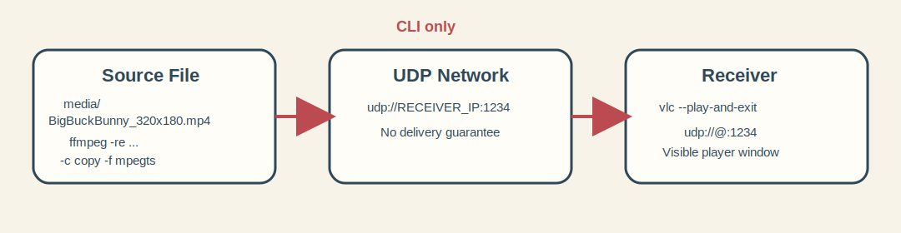
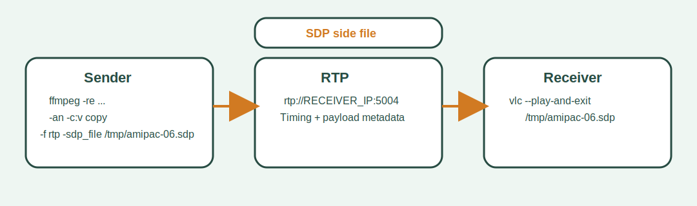

# Connectionless Streaming of Multimedia Content

Andrzej M. and Mikolaj L.

## Introduction

The purpose of this exercise is to learn how to stream multimedia content over connectionless transport, primarily UDP, and to compare that approach with RTP used on top of UDP.

The exercise uses UNIX command-line tools as the primary path. The recommended toolset is `ffmpeg` and `VLC` started from the command line. `ffplay` can still be used optionally, but the verified path in this exercise uses `VLC`.


*Fig. Sample source material used for local streaming tests.*

## Learning Goals

After completing the exercise, the student should be able to:

- explain the difference between connection-oriented and connectionless streaming,
- distinguish plain UDP transport from RTP carried over UDP,
- start a sender and a receiver from the command line,
- test the impact of direct remuxing vs. transcoding,
- identify basic practical issues such as packet loss, jitter, buffering and multicast limitations.

## Prerequisites

### Required knowledge

Before the lab, the student should know:

- the role of a streaming server and a streaming client,
- the basics of IP, UDP, TCP, RTP and RTSP,
- why connectionless transport may reduce latency but does not guarantee delivery,
- the difference between remuxing and transcoding.

### Required software

The exercise is designed for Ubuntu and macOS. Install:

- `ffmpeg`,
- `vlc` or `cvlc`,
- optionally `ffplay`.

Typical installation commands:

```bash
# Ubuntu
sudo apt update
sudo apt install ffmpeg vlc

# macOS with Homebrew
brew install ffmpeg
brew install --cask vlc
```

### Lab materials

Run commands from the exercise root directory:

```bash
cd "06 Connectionless Streaming of Multimedia Content"
```

Sample video files are stored in `media/`.

Useful files:

- `media/BigBuckBunny_320x180.mp4`

## Network Preparation

Check the IP address of the machine that will send the stream.

```bash
# Ubuntu
ip addr

# macOS
ifconfig
```

For local testing on one machine, use the loopback address `127.0.0.1`.

## Exercise

### Expected outputs

The exercise should not be only observational. Each student should produce:

1. one working UDP stream visible in a player window,
2. one working RTP stream visible in a player window,
3. one short comparison table: `protocol`, `startup delay`, `CPU cost`, `notes`,
4. one conclusion on when `-c copy` is enough and when transcoding is needed.

### Part 1. Inspect the source material

Check basic information about a source file:

```bash
ffprobe -hide_banner media/BigBuckBunny_320x180.mp4
```

Answer:

1. What are the container format, video codec and audio codec?
2. What are the duration, resolution and average bitrate?
3. Which sample file is the safest choice for low-latency local tests?

### Part 2. UDP unicast without transcoding

Open two terminals.



*Fig. Basic CLI workflow for UDP unicast.*

Receiver:

```bash
# Ubuntu
vlc --play-and-exit "udp://@:1234"

# macOS
"/Applications/VLC.app/Contents/MacOS/VLC" --play-and-exit "udp://@:1234"
```

Sender:

```bash
ffmpeg -re -stream_loop -1 -i media/BigBuckBunny_320x180.mp4 \
  -c copy -f mpegts "udp://RECEIVER_IP:1234?pkt_size=1316"
```

Notes:

- Replace `RECEIVER_IP` with the receiver host address.
- For a single-computer test, use `127.0.0.1`.
- `-c copy` avoids transcoding and keeps CPU usage low.
- MPEG-TS is used here because it is a practical transport container for raw UDP streaming.

Answer:

1. Does the stream start immediately, or is buffering visible?
2. What happens after packet loss or after closing and reopening the receiver?
3. Why is plain UDP suitable for some low-latency use cases despite missing delivery guarantees?

### Part 3. UDP unicast with transcoding

Run the same test again, but transcode the stream to H.264 and keep the dimensions explicitly even:

Receiver:

```bash
# Ubuntu
vlc --play-and-exit "udp://@:1234"

# macOS
"/Applications/VLC.app/Contents/MacOS/VLC" --play-and-exit "udp://@:1234"
```

Sender:

```bash
ffmpeg -re -stream_loop -1 -i media/BigBuckBunny_320x180.mp4 \
  -an \
  -vf "scale=trunc(iw/2)*2:trunc(ih/2)*2" \
  -c:v libx264 -preset veryfast -tune zerolatency \
  -pix_fmt yuv420p -g 48 \
  -f mpegts "udp://RECEIVER_IP:1234?pkt_size=1316"
```

Answer:

1. How does CPU usage change compared with `-c copy`?
2. Does transcoding change startup delay?
3. When is transcoding necessary even if it increases complexity?

### Part 4. RTP over UDP

RTP adds timing and payload metadata on top of UDP and is usually easier to analyze than raw UDP transport. For this part, use video only.



*Fig. RTP over UDP requires a small SDP description in addition to the sender and receiver commands.*

Sender:

```bash
ffmpeg -re -stream_loop -1 -i media/BigBuckBunny_320x180.mp4 \
  -an -c:v copy \
  -f rtp -sdp_file /tmp/amipac-06.sdp "rtp://RECEIVER_IP:5004"
```

Receiver:

```bash
# Ubuntu
vlc --play-and-exit /tmp/amipac-06.sdp

# macOS
"/Applications/VLC.app/Contents/MacOS/VLC" --play-and-exit /tmp/amipac-06.sdp
```

If sender and receiver are on different machines, copy the generated SDP file to the receiver and, if needed, correct the IP address inside it.

Answer:

1. What practical difference do you observe between plain UDP transport and RTP?
2. Why is an SDP description needed here?
3. In which scenarios is RTP a better default than sending MPEG-TS over plain UDP?

### Part 5. Optional multicast

If the lab network supports multicast, repeat the experiment with a multicast address, for example `239.255.0.1`.

Example sender:

```bash
ffmpeg -re -stream_loop -1 -i media/BigBuckBunny_320x180.mp4 \
  -c copy -f mpegts "udp://239.255.0.1:1234?pkt_size=1316"
```

Example receiver:

```bash
vlc --play-and-exit "udp://@239.255.0.1:1234"
```

Important:

- multicast often does not work on Wi-Fi,
- multicast may be blocked in campus or enterprise networks,
- if multicast fails, document the failure and possible network-side reasons.

### Part 6. Re-streaming from WAN sources

Do not base the exercise on YouTube. In current practice, direct extraction of playable media URLs from YouTube is unstable and often blocked.

Use one of these safer options instead:

- a local sample file from `media/`,
- a directly accessible MP4 or MOV file over HTTP or HTTPS,
- a stream source explicitly prepared for lab use.

Example:

```bash
ffmpeg -re -i "https://archive.org/download/ElephantsDream/ed_1024_512kb.mp4" \
  -c copy -f mpegts "udp://RECEIVER_IP:1234?pkt_size=1316"
```

If a remote source is unavailable or throttled, explain why local source files are a better baseline for reproducible experiments.

## Report

If a report is required, include:

1. the tested commands,
2. the sender and receiver addresses,
3. the source file that was used,
4. observations about startup time, buffering and stability,
5. a comparison of plain UDP and RTP,
6. remarks on multicast support or lack of support,
7. conclusions about when transcoding is necessary.

## References

1. FFmpeg Documentation, <https://ffmpeg.org/documentation.html>
2. FFmpeg Protocols Documentation, <https://ffmpeg.org/ffmpeg-protocols.html>
3. FFplay Documentation, <https://ffmpeg.org/ffplay.html>
4. VLC User Documentation, <https://docs.videolan.me/vlc-user/>
5. VLC Streaming Example, <https://docs.videolan.me/vlc-user/desktop/3.0/en/advanced/streaming/stream_over_http.html>
6. RFC 768: User Datagram Protocol, <https://www.rfc-editor.org/rfc/rfc768>
7. RFC 3550: RTP: A Transport Protocol for Real-Time Applications, <https://www.rfc-editor.org/rfc/rfc3550>
