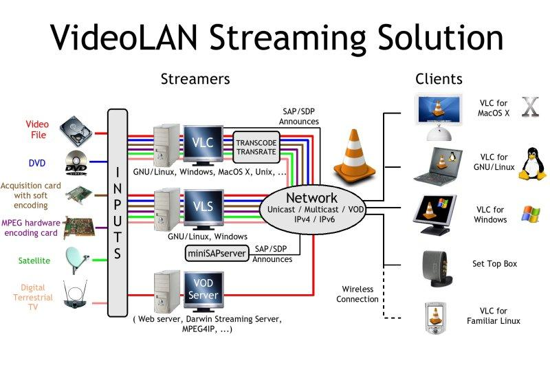
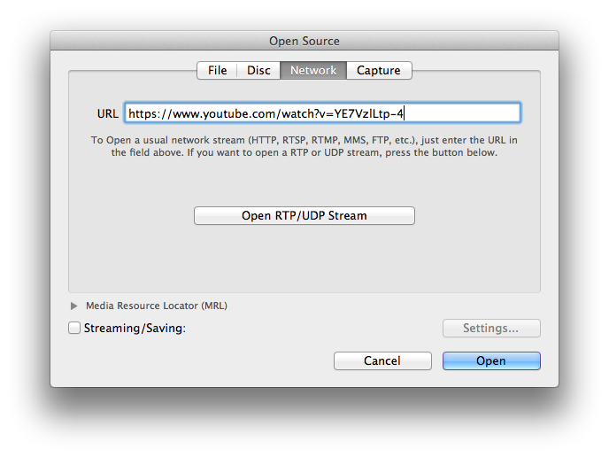
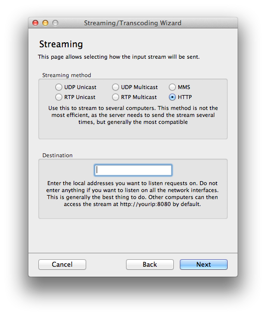
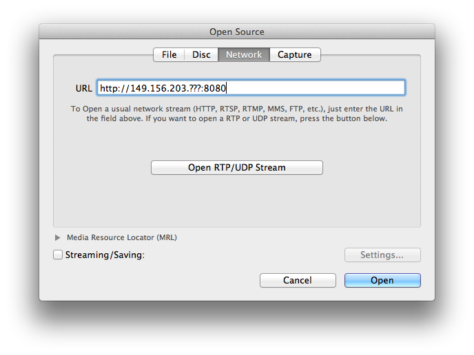

# Connection-Oriented Streaming of Multimedia Content

Andrzej Matiolanski, Mikolaj Leszczuk

## Introduction

The purpose of this exercise is to practice connection-oriented multimedia streaming workflows and compare practical behavior of HTTP and RTSP carried over TCP.

Scope note: this exercise focuses on HTTP/TCP and RTSP/TCP paths. UDP/RTP paths are covered in Exercise 06 and are not the target here.

The exercise is CLI-first on UNIX systems (Ubuntu and macOS). The recommended and verified path is:

- `ffmpeg` as sender,
- `VLC` started from CLI as receiver.

`ffplay` is optional as a fallback player.

## Learning Goals

After completing this exercise, the student should be able to:

- explain why connection-oriented transport can improve delivery stability,
- start HTTP and RTSP streams from the command line,
- receive and validate the stream with CLI-launched VLC,
- compare startup delay and robustness of HTTP vs RTSP over TCP,
- decide when remuxing (`-c copy`) is enough and when transcoding is needed.

## Prerequisites

### Required software

Install:

- `ffmpeg`,
- `vlc` or `cvlc`,
- `mediamtx` (required for the RTSP/TCP broker role in Part 3),
- optionally `ffplay`.

Typical installation commands:

```bash
# Ubuntu
sudo apt update
sudo apt install ffmpeg vlc

# macOS with Homebrew
brew install ffmpeg
brew install --cask vlc
brew install mediamtx
```

### Lab materials

Run commands from the exercise root directory:

```bash
cd "07 Connection-Oriented Streaming of Multimedia Content"
```

Student sample media:

- `media/BigBuckBunny_320x180.mp4`

Helper scripts:

- `scripts/stream-http.sh`
- `scripts/receive-http.sh`
- `scripts/start-rtsp-broker.sh`
- `scripts/stream-rtsp-tcp.sh`
- `scripts/receive-rtsp.sh`

### Tooling

<div style="display:flex; gap:12px; flex-wrap:wrap; align-items:center;">
  
  
  
  
</div>

### VLC workflow diagram



*Fig. 2. A diagram showing how VLC can be used for streaming solutions.*

Additional VLC views used in this exercise:

<div style="display:flex; gap:14px; flex-wrap:wrap; align-items:flex-start;">
  
  
  
</div>


## Grading Policy

Required (graded) path:

- stable local source: `media/BigBuckBunny_320x180.mp4`,
- HTTP/TCP workflow from `scripts/stream-http.sh` and `scripts/receive-http.sh`,
- RTSP/TCP workflow from `scripts/start-rtsp-broker.sh`, `scripts/stream-rtsp-tcp.sh`, and `scripts/receive-rtsp.sh`,
- report observations from these deterministic paths.

Optional (best-effort, not required for passing):

- captions availability in third-party sources (for example Dailymotion),
- direct re-streaming from Dailymotion or other external platforms,
- any external-source failures caused by source-side policy or availability changes.

If an optional external-source path fails, document the attempt and reason. This does not reduce the grade when required local paths are completed correctly.

## Exercise

### Part 1. Inspect sample media

```bash
ffprobe -hide_banner media/BigBuckBunny_320x180.mp4
```

Answer:

1. What are the codecs and resolution?
2. Is this sample suitable for low-latency local streaming tests?

### Part 2. HTTP over TCP

Open two terminals.

Sender:

```bash
scripts/stream-http.sh media/BigBuckBunny_320x180.mp4 0.0.0.0 8080
```

Receiver:

```bash
scripts/receive-http.sh http://127.0.0.1:8080/stream.ts
```

Answer:

1. How quickly does playback start?
2. What happens when you restart the receiver while sender keeps running?
3. What are practical pros and cons of HTTP streaming for lab environments?

### Part 3. RTSP over TCP

Open three terminals.

Broker (Terminal 1):

```bash
scripts/start-rtsp-broker.sh
```

Sender:

```bash
scripts/stream-rtsp-tcp.sh media/BigBuckBunny_320x180.mp4 127.0.0.1 8554 live
```

Receiver:

```bash
scripts/receive-rtsp.sh rtsp://127.0.0.1:8554/live
```

Answer:

1. How does startup and seek behavior compare with HTTP?
2. Which protocol is easier to manage in your current network setup?
3. In what scenario is RTSP a better fit than plain HTTP streaming?

Important:

- in current FFmpeg 8.x packaging, direct RTSP listen mode in FFmpeg sender is not reliable for this lab setup,
- therefore Part 3 uses an explicit RTSP broker (`mediamtx`) and keeps FFmpeg as sender plus VLC as receiver.

### Part 4. Transcoding comparison

Repeat the HTTP path from Part 2 with transcoding and compare it with `-c copy`.

Sender:

```bash
ffmpeg -re -stream_loop -1 -i media/BigBuckBunny_320x180.mp4 \
  -an -c:v libx264 -preset veryfast -tune zerolatency \
  -pix_fmt yuv420p -g 48 \
  -f mpegts -listen 1 http://0.0.0.0:8080/stream.ts
```

Receiver:

```bash
scripts/receive-http.sh http://127.0.0.1:8080/stream.ts
```

Answer:

1. How does CPU usage compare to `-c copy`?
2. When is transcoding worth the extra cost?


## Report

If a report is required, include:

1. sender and receiver commands,
2. tested addresses and ports,
3. observed startup delay,
4. behavior after receiver restart,
5. comparison of HTTP and RTSP over TCP,
6. conclusion on remuxing vs transcoding.

## References

1. FFmpeg Documentation, <https://ffmpeg.org/documentation.html>
2. FFmpeg Protocols, <https://ffmpeg.org/ffmpeg-protocols.html>
3. VLC User Documentation, <https://docs.videolan.me/vlc-user/>
4. RFC 2326: Real Time Streaming Protocol (RTSP), <https://www.rfc-editor.org/rfc/rfc2326>
5. RFC 2616 (historic) / HTTP core RFC set, <https://httpwg.org/specs/>

